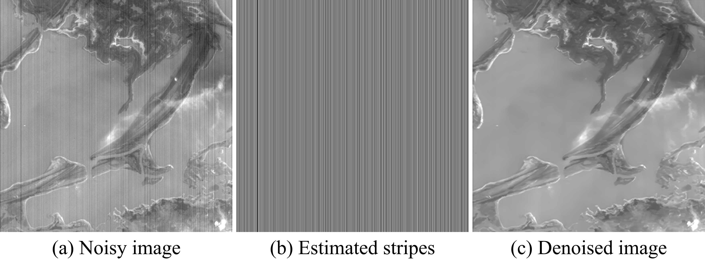

# Self-BSR: Self-Supervised Image Denoising and Destriping Based on Blind-Spot Regularization

This is an official PyTorch implementation of "Self-BSR: Self-Supervised Image Denoising and Destriping Based on Blind-Spot Regularization" in TCSVT 2025.



## Abstract
_Digital images captured by unstable imaging systems often simultaneously suffer from random noise and stripe noise. Due to the complex noise distribution, denoising and destriping methods based on simple handcrafted priors may leave residual noise. Although supervised methods have achieved some progress, they rely on large-scale noisy-clean image pairs, which are challenging to obtain in practice. To address these problems, we propose a self-supervised image denoising and destriping method based on blind-spot regularization, named Self-BSR. This method transforms the overall denoising and destriping problem into a modeling task for two spatially correlated signals: image and stripe. Specifically, blind-spot regularization leverages spatial continuity learned by the improved blind-spot network to separately constrain the reconstruction of image and stripe while suppressing pixel-wise independent noise. This regularization has two advantages: first, it is adaptively formulated based on implicit network priors, without any explicit parametric modeling of image and noise; second, it enables Self-BSR to learn denoising and destriping only from noisy images. In addition, we introduce the directional feature unshuffle in Self-BSR, which extracts multi-directional information to provide discriminative features for separating image from stripe. Furthermore, the featureresampling refinement is proposed to improve the reconstruction ability of Self-BSR by resampling pixels with high spatial correlation in the receptive field. Extensive experiments on synthetic and real-world datasets demonstrate significant advantages of the proposed method over existing methods in denoising and destriping performance._

[[Paper](https://ieeexplore.ieee.org/document/10960454)]

---

## Setup

### Requirements

Our experiments are done with:

- Python 3.9.5
- PyTorch 1.9.0
- numpy 1.21.0
- opencv 4.5.2
- scikit-image 0.18.1

### Directory

Follow below descriptions to build dataset directory.

```

├─ dataset
├─ train
│  ├─ clean
│  ├─ noise
├─ val
│  ├─ clean
│  ├─ noise
├─ test
│  ├─ clean
│  ├─ noise
```

## Training & Test

### Training

```
python train.py --name your_exp_name --dataset_path your_dataset_path 
```

### Test
> with FRR
```
python test.py --name your_exp_name --dataset_path your_dataset_path --frr
```
> without FRR
```
python test.py --name your_exp_name --dataset_path your_dataset_path
```

## Citation

```
@article{qu2025self,
  title={Self-BSR: Self-Supervised Image Denoising and Destriping Based on Blind-Spot Regularization},
  author={Qu, Chao and Chen, Zewei and Zhang, Jingyuan and Chen, Xiaoyu and Han, Jing},
  journal={IEEE Transactions on Circuits and Systems for Video Technology},
  year={2025},
  publisher={IEEE}
}
```